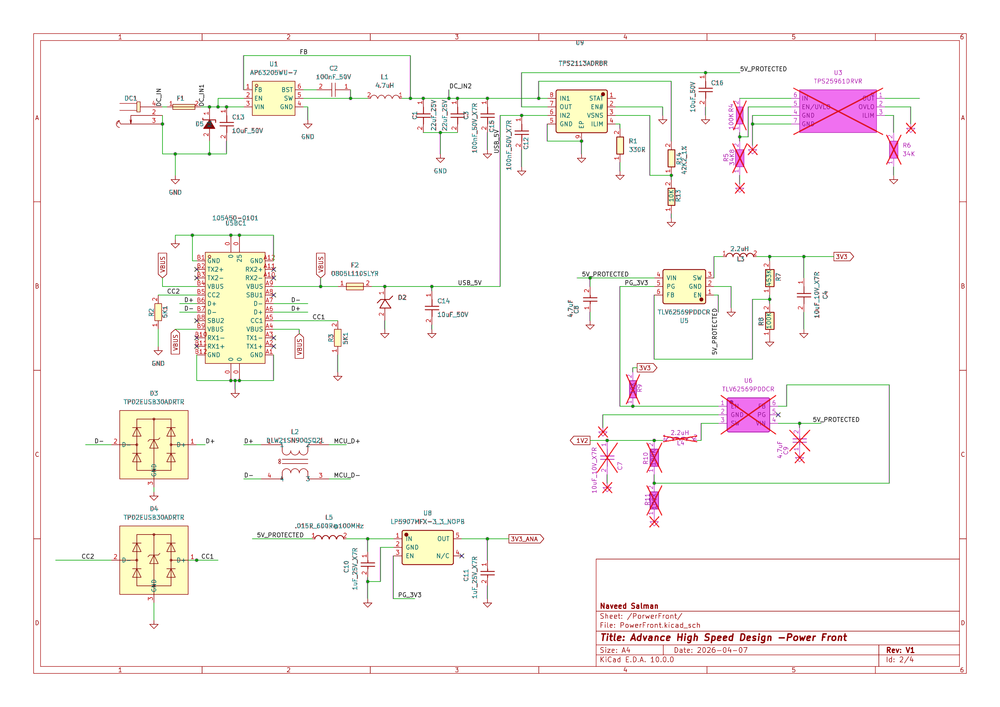
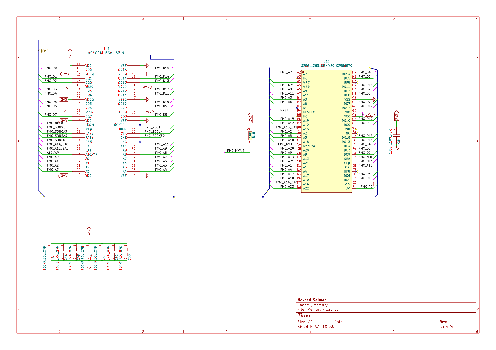
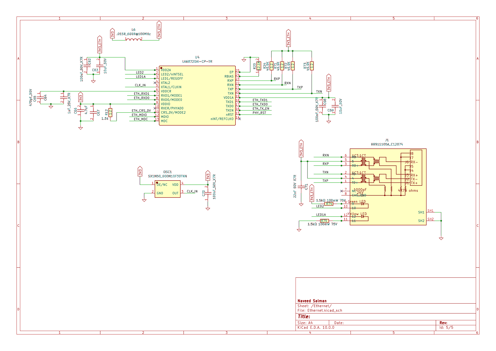

## ⚡ Power Distribution Network (PDN) & Protection
The power subsystem is designed to provide stable, low-noise rails while ensuring hardware longevity through multi-stage industrial protection. 

### 1. Input Protection and Source Management
The board features a dual-input architecture supporting both a DC Jack (unregulated) and USB-C (VBUS).
* **Primary Protection:** The DC input includes a surface-mount fuse (**F1**) and a transient voltage suppressor (**D5**) to protect against overcurrent and high-voltage spikes.
* **Power Multiplexing (TPS2113A):** A dedicated power mux (**U2**) manages the transition between the DC input and USB power. It prevents back-feeding and ensures a seamless 5V supply to the downstream regulators.

### 2. Multi-Stage Voltage Regulation
The design utilizes a hierarchical approach to down-conversion to optimize efficiency and noise performance:
* **Intermediate Rail (AP63205):** A synchronous buck converter (**U1**) steps down the primary DC input to a stable $5\text{V}$ rail.
* **Digital System Rails (TLV62569):** Two high-frequency synchronous buck converters (**U5**, **U6**) generate the $3.3\text{V}$ I/O rail and the $1.2\text{V}$ STM32 core rail. These are sized to handle high-frequency switching loads from the FMC bus and the Cortex-M7 core.
* **Precision Analog Rail (LP5907):** To ensure the integrity of the 24-bit ADC and Audio Codec, an **LP5907** ultra-low-noise LDO (**U8**) is used to derive a dedicated ($3.3\text{V}$) analog supply 3.3V_ANA.

### 3. Signal Integrity and ESD Protection
* **USB-C Interface:** The USB data lines ($D+/D-$) and Configuration Channel ($CC$) lines are protected by **TPD2EUSB30** ESD suppressor arrays (**D3**, **D4**). 
* **Common Mode Filtering:** A common-mode choke (**L2**) is implemented on the USB differential pair to mitigate EMI.
* **Noise Isolation:** A ferrite bead (**L5**) and dedicated decoupling network isolate the analog power domain from high-frequency digital switching noise.

## 🧠 External Memory Architecture (SDRAM & Parallel NOR Flash)

The system utilizes a high-performance memory subsystem consisting of both volatile and non-volatile memory. To optimize pin count, both devices are integrated onto a shared 16-bit parallel bus via the STM32H7 Flexible Memory Controller (FMC).

### Component Summary
| Memory Type | Part Number | Capacity | Interface |
| :--- | :--- | :--- | :--- |
| **SDRAM** | AS4C4M16SA | 64 MB | 16-bit Synchronous (120MHz) |
| **NOR Flash** | S29GL128S | 16 MB | 16-bit Asynchronous (Page Mode) |

### 1. High-Speed SDRAM Workspace
The SDRAM serves as the primary volatile workspace for the 480MHz Cortex-M7 core, providing the necessary bandwidth for large data buffers and real-time processing.
* **Clock Management:** The interface is driven by a 120MHz SDCLK. A 22 Ohm series termination resistor is placed at the source to prevent signal reflections and overshoot.
* **16-bit Data Path:** Configured to balance high-speed throughput with PCB routing density.
* **Bank Management:** All 4 internal banks are utilized, with the FMC managing the row/column addressing logic.

### 2. Non-Volatile Parallel NOR Flash
The S29GL128S provides high-reliability storage for firmware and critical system data, supporting Execute-in-Place (XiP) functionality.
* **Page Mode Optimization:** Configured to use 8-word page access. While the initial random access time is 100ns, subsequent burst reads from the same page are reduced to 25ns.
* **Hardware Handshaking:** The RY/BY# (Ready/Busy) output is connected to the FMC_NWAIT pin with a 4.7k Ohm pull-up resistor. This allows the hardware to automatically stall the processor during Flash programming or erase operations if the bus is accessed.
* **Write Protection:** The WP# pin is tied to the 3.3V IO rail to ensure the memory is always available for updates, with software-level protection providing the secondary security layer.

### 3. Bus Multiplexing and Pin Sharing
A key challenge of the design is the physical sharing of the address and data bus between two different memory technologies.
* **Address Mapping:** The FMC_A14/BA0 and FMC_A15/BA1 pins are multiplexed. The hardware ensures that when SDRAM is active (SDNE0 Low), the Bank Address logic takes precedence; when Flash is active (NE1 Low), the standard Address logic is applied.
* **Bus Contention Prevention:** Chip Select (CS) signals are strictly independent. The SDRAM remains in a High-Impedance (High-Z) state while the Flash is being accessed, and vice-versa.
* **Synchronized Reset:** The Flash RESET# pin is connected to the global system NRST, ensuring the memory controller and the storage device are synchronized during power-up or watchdog reset events.

### 4. Schematic-Level Signal Integrity Measures
While the physical routing is reserved for the next phase, the schematic includes critical foundational elements to ensure high-speed stability:

## 🌐 Industrial Ethernet Interface (10/100 Mbps)

The communication subsystem features a high-reliability 10/100 Mbps Ethernet interface using the **Microchip LAN8720AI** Industrial Temperature PHY. This stage is critical for edge-gateway connectivity and real-time data streaming.

### Interface & Synchronization
* **RMII Architecture:** The system utilizes the Reduced Media Independent Interface (RMII) to minimize pin count while maintaining a 100 Mbps data rate. 
* **Synchronous Clocking:** A dedicated **50MHz Active Oscillator** provides a unified reference clock to both the LAN8720AI and the STM32H7 RMII_REF_CLK input. This hardware-level synchronization eliminates the jitter common in MCU-generated clocks (MCO), ensuring stable link performance in high-EMI environments.

### Power Domain Isolation & Signal Integrity
To protect the precision of the 24-bit ADC, the Ethernet power domain is strictly isolated:
* **Isolated Rails:** The PHY analog supply (VDDA) and the RJ45 magnetics center taps are derived from the main 3.3V digital rail through a high-impedance **Ferrite Bead**. This prevents high-frequency switching noise from the transceivers from coupling into the sensitive analog acquisition rails.
* **Magnetic Integration:** The design utilizes an **RJ45 MagJack (HR911105A)** with integrated 1:1 isolation transformers. This provides 1500Vrms isolation and integrated common-mode filtering.
* **Termination:** 49.9 Ohm (1%) precision resistors are utilized for differential pair impedance matching, placed in close proximity to the PHY pins.

### Protection & Robustness
* **ESD Suppression:** The differential TX/RX pairs are protected by a low-capacitance ESD array, ensuring the high-speed signal integrity is not compromised while providing protection against cable-discharge events (CDE).
* **Common Mode Filtering:** A discrete common-mode choke is placed on the differential lines to suppress radiated emissions, aiding in future EMC compliance testing.

### Bootstrap Configuration
The PHY is hardware-configured at power-up via strapping resistors:
* **nINTSEL:** Configured for **REF_CLK In** mode to accept the 50MHz external oscillator.
* **REGOFF:** Internal 1.2V regulator enabled, simplifying the power tree and reducing external component requirements.
* **PHYAD:** Hardware-set to Address 0 for deterministic software initialization via the MDIO/MDC management interface.
* **Series Termination:** Included 22 Ohm resistors on high-speed lines (like SDCLK) to manage impedance and dampen potential reflections at the source.
* **Decoupling Strategy:** Implemented a comprehensive decoupling matrix for the BGA footprints, utilizing a mix of 100nF and 1uF ceramic capacitors to provide local charge reservoirs for every power pin.
* **Pin Mapping Logic:** Carefully mapped the multiplexed FMC pins (A14/BA0 and A15/BA1) to ensure the STM32H7 can correctly address both the 4-bank SDRAM and the linear Page-Mode Flash without electrical conflicts.
* **Hardware Handshaking:** Integrated the RY/BY# to NWAIT hardware link with a dedicated pull-up resistor to prevent bus-stall issues during Flash erase/write cycles.
