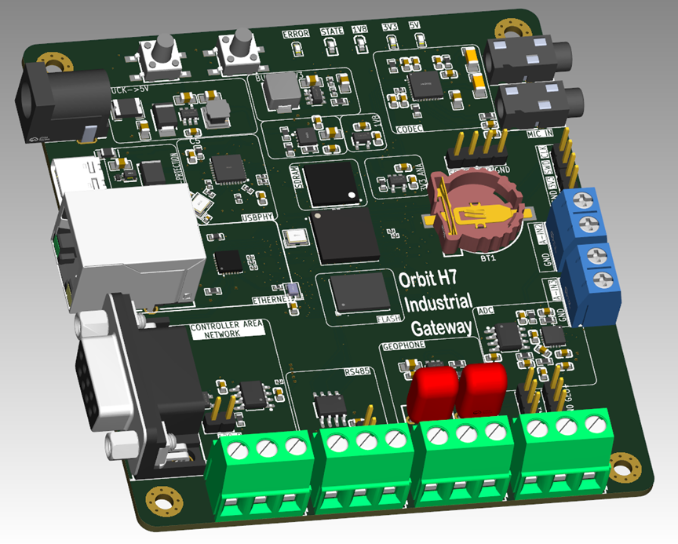
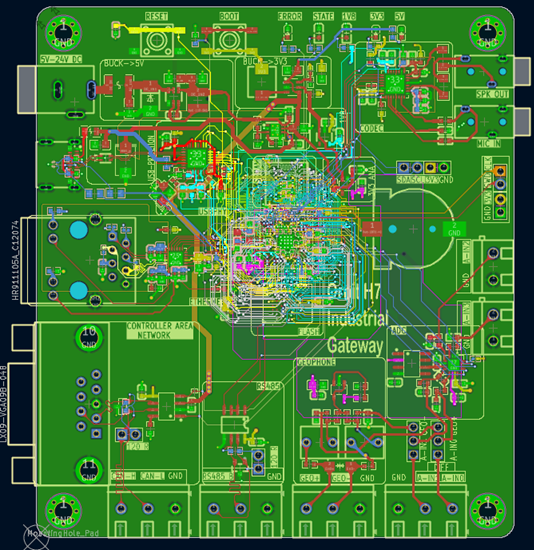
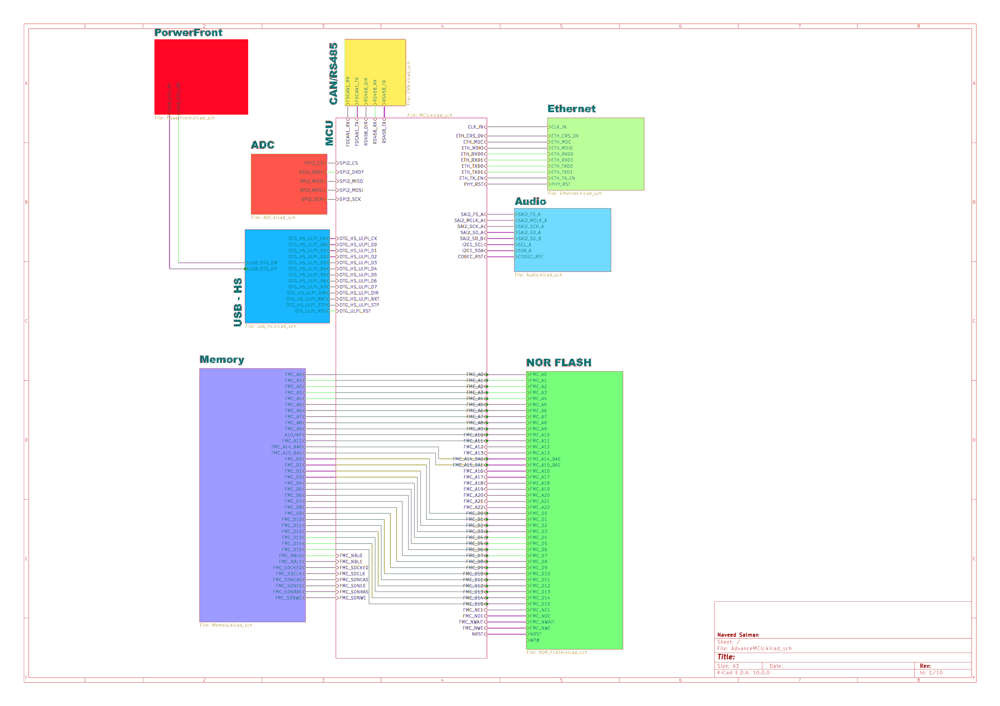
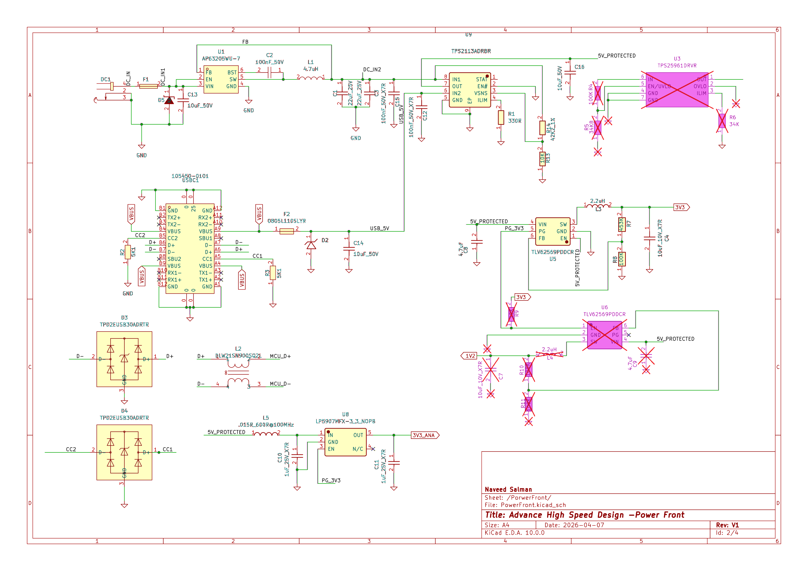
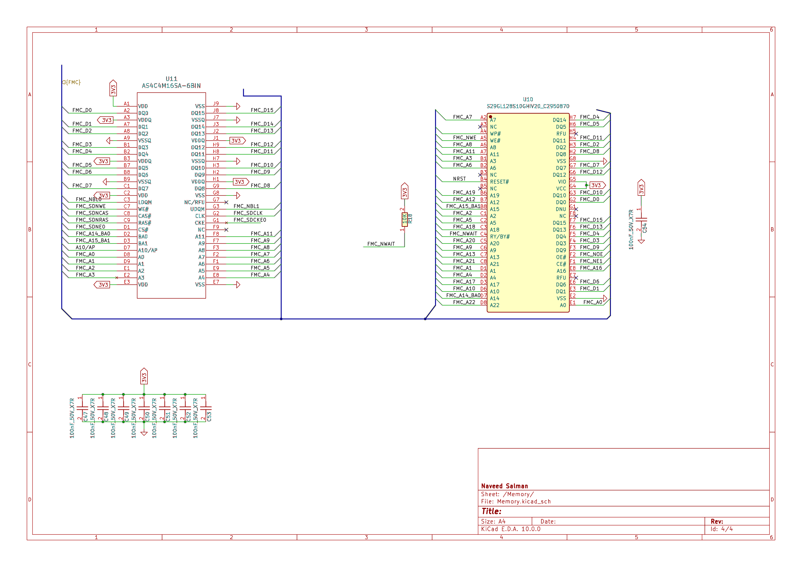
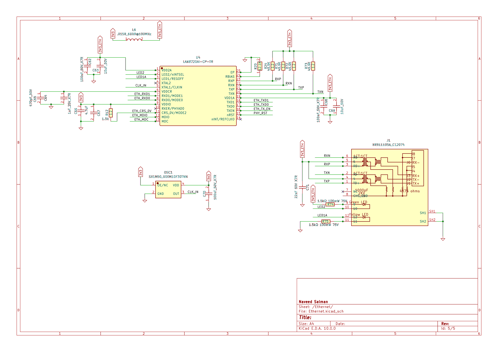
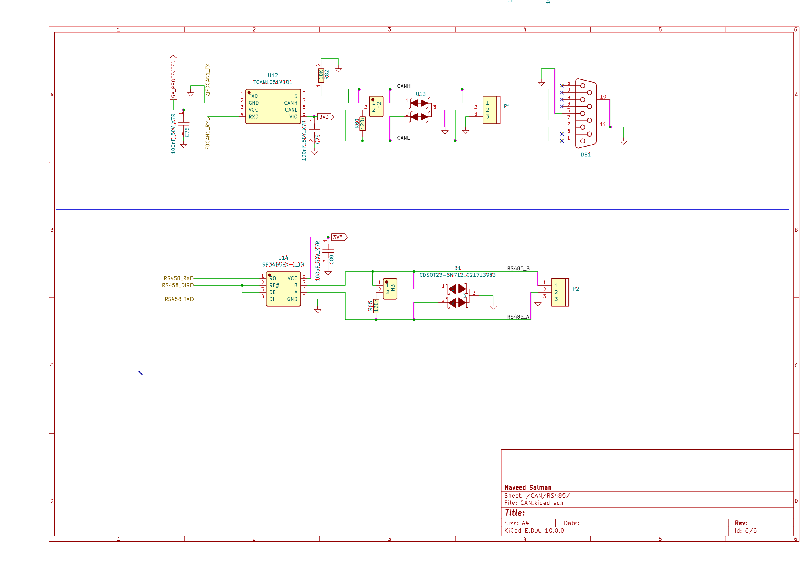
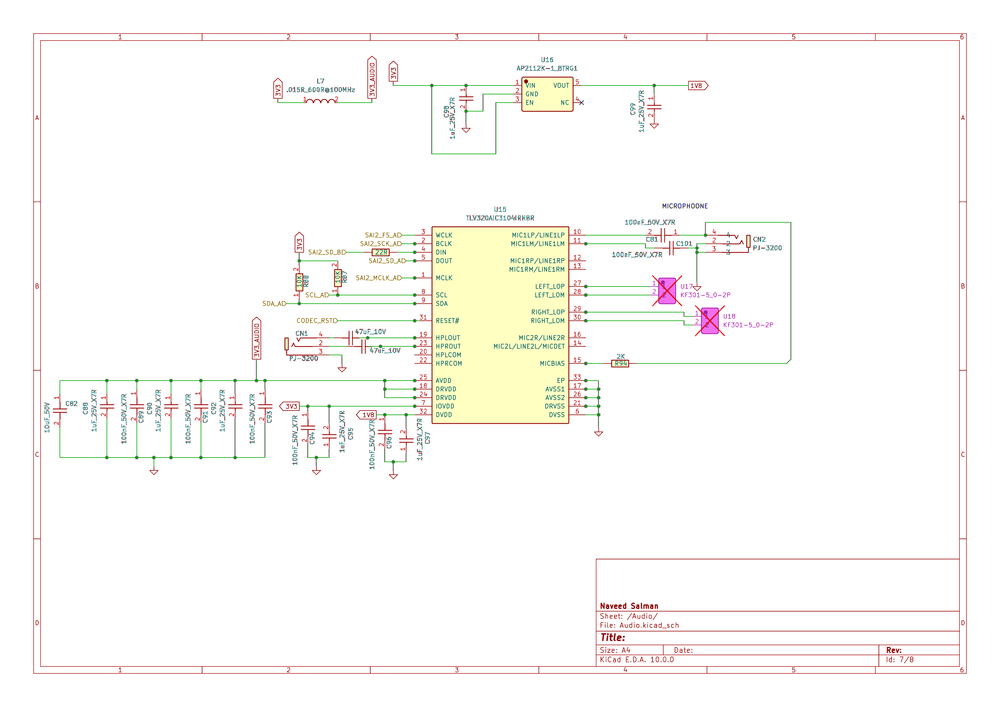
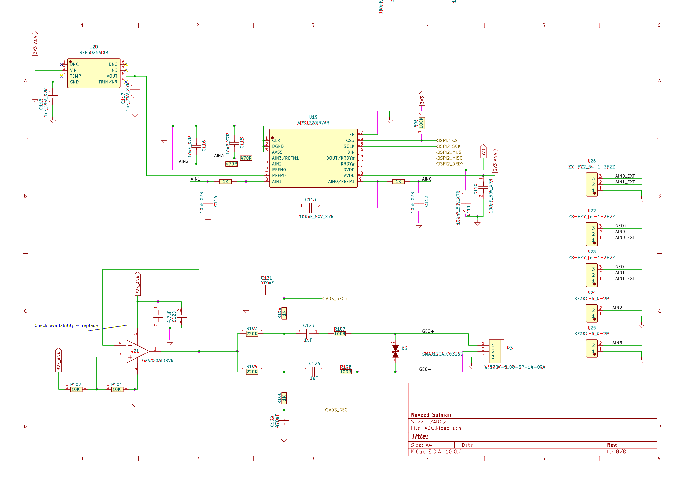
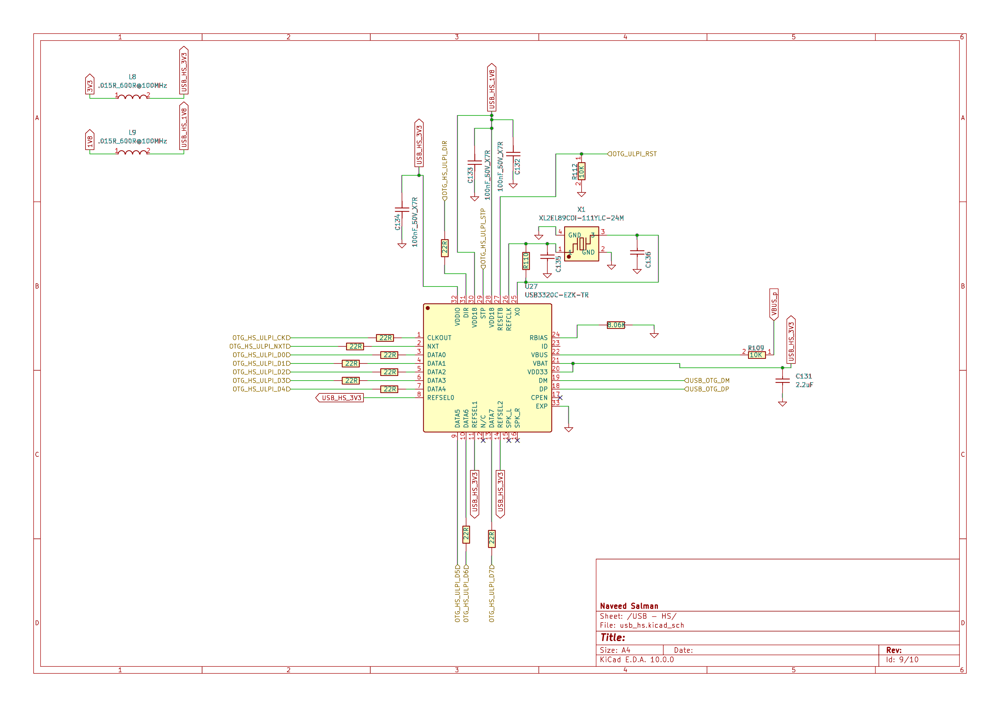

# STM32H7 Industrial Gateway

**Project status: PCB layout complete — final verification before manufacture**

The STM32H7 Industrial Gateway is a **10-layer mixed-signal embedded system** built around the STM32H743 microcontroller. It combines external parallel memory, high-speed communications, industrial interfaces, precision data acquisition, audio processing and a multi-rail power architecture on a single PCB.

The board has not yet been manufactured or electrically validated. The current design is undergoing final schematic, layout and manufacturing-file verification before fabrication.

*Completed PCB layout showing the STM32H7 processor, external memories, communication interfaces, analogue acquisition circuitry and multi-rail power system.*

## Project Objective

The project was developed to demonstrate practical capability in:

* High-density BGA PCB design
* High-speed parallel-memory integration
* Mixed-signal system partitioning
* Controlled-impedance routing
* Power-distribution-network design
* USB 2.0 High-Speed and Ethernet integration
* Industrial CAN and RS-485 communications
* Precision sensor acquisition
* Design-for-manufacture and structured board bring-up

## System Overview

The board integrates:

* **STM32H743IIK6** Arm Cortex-M7 BGA microcontroller
* **8 MB external SDRAM**
* **16 MB parallel NOR flash**
* USB 2.0 High-Speed through an external ULPI PHY
* 10/100 Ethernet through an RMII PHY
* CAN FD-capable physical interface
* Half-duplex RS-485 interface
* 24-bit sigma-delta ADC and geophone analogue front end
* 24-bit stereo audio codec
* Multi-rail switching and linear power supplies
* USB-C and external DC power inputs
* SWD programming and debugging interface

The PCB was developed around signal integrity, power integrity, return-current continuity, functional partitioning, manufacturability and practical board bring-up.

## Core Processing

The system is based on the **STM32H743**, a high-performance Arm Cortex-M7 microcontroller capable of operating at up to **480 MHz**.

The MCU provides:

* Flexible Memory Controller for external SDRAM and parallel NOR flash
* USB High-Speed controller with external ULPI PHY support
* Ethernet MAC with RMII interface
* FDCAN controllers
* SPI, I²C, UART and SAI interfaces
* DMA support for memory, communication and audio transfers
* Hardware debugging through SWD
* Internal instruction and data caches
* Tightly coupled memories for deterministic code and data access

The BGA package provides the required interface density but introduces significant fanout, decoupling and routing constraints.

## Placement Strategy

The STM32H7 is positioned near the centre of the PCB, with the SDRAM and parallel NOR flash placed close to the MCU to reduce FMC bus length and routing congestion.

The remaining circuitry is divided into clear functional regions:

* Power entry and regulation near the DC and USB-C inputs
* USB PHY close to the USB-C connector
* Ethernet PHY and magnetics close to the RJ45 connector
* CAN and RS-485 transceivers close to their field connectors
* ADC and geophone circuitry separated from memory buses and switching nodes
* Audio circuitry grouped around the codec and audio connectors
* Reset, boot, status and debug controls kept accessible
* Sensitive clocks kept short and away from low-level analogue signals

This placement strategy reduces unnecessary signal length, limits crossover between unrelated interfaces and provides identifiable bring-up and debugging regions.

## 10-Layer Stackup and Routing

A **10-layer PCB stackup** was selected to provide sufficient routing capacity for the BGA processor, external parallel memories and multiple communication interfaces while retaining continuous reference planes.

The layout includes:

* Continuous ground-reference planes
* Dedicated internal routing resources for the SDRAM and NOR flash buses
* Controlled-impedance USB and Ethernet differential pairs
* Length and skew constraints for timing-related memory signals
* Short clock routes with uninterrupted return paths
* Ground-return vias near critical signal-layer transitions
* Separate net classes for power, analogue, memory and high-speed interfaces
* Controlled BGA breakout widths and via structures
* Local ground stitching around interface and board-edge regions

The stackup is intended to support predictable signal return paths and reduce coupling between the memory, communication, power and analogue subsystems.

Final impedance values and fabrication parameters will be confirmed against the selected PCB manufacturer's production stackup before release.

## Power Distribution Network

The board supports both an external DC input and USB-C VBUS power.

The power architecture includes:

* Input fuse and transient protection
* Automatic power-source selection
* 5 V intermediate rail
* 3.3 V digital rail
* 1.2 V MCU core rail
* Filtered low-noise analogue rail
* Local filtering for communication and mixed-signal devices
* Bulk and high-frequency decoupling
* Dedicated internal power-distribution layers

### Input Protection and Source Selection

The external DC input includes:

* Series fuse protection
* Transient-voltage suppression
* Reverse-current management through the power-selection stage
* Input and output bulk capacitance

A **TPS2113A power multiplexer** manages the available 5 V sources and prevents unwanted back-feeding between the external supply and USB-C VBUS.

### Voltage Regulation

The power-conversion chain uses a combination of switching regulators and a low-noise linear regulator:

* **AP63205 synchronous buck converter** for the primary 5 V conversion
* **TLV62569 synchronous buck converters** for the 3.3 V and 1.2 V digital rails
* **LP5907 low-noise LDO** for the dedicated analogue supply

Switching-regulator placement was driven by current-loop geometry. Input capacitors, switching nodes, inductors and output capacitors were positioned to minimise loop area and reduce conducted and radiated noise.

### Decoupling and Power Delivery

The power-distribution network uses:

* Local 100 nF decoupling close to device power pins
* Additional 1 µF and bulk capacitance at major loads
* Bottom-side decoupling beneath the MCU BGA
* Multiple power and ground vias
* Short connections between decoupling capacitors and reference planes
* Ferrite-bead filtering where subsystem noise separation is required
* Continuous ground references rather than isolated or disconnected ground regions

The design does not rely on split ground planes. Analogue and digital circuitry are separated primarily through placement, current-path control, local filtering and careful routing.

## External Memory Architecture

The system includes both volatile and non-volatile external memory connected through the STM32H7 Flexible Memory Controller.

| Memory             | Part number | Organisation | Capacity         | Interface           |
| :----------------- | :---------- | :----------- | :--------------- | :------------------ |
| SDRAM              | AS4C4M16SA  | 4M × 16-bit  | 64 Mbit / 8 MB   | 16-bit synchronous  |
| Parallel NOR flash | S29GL128S   | 8M × 16-bit  | 128 Mbit / 16 MB | 16-bit asynchronous |

### SDRAM

The **AS4C4M16SA** provides high-speed volatile storage for:

* Large acquisition buffers
* Ethernet and USB data buffering
* Audio buffers
* Signal-processing workspaces
* Application data that exceeds the MCU's internal SRAM capacity

The interface uses:

* 16-bit data bus
* Multiplexed row and column addressing
* Four internal SDRAM banks
* SDRAM clock, clock-enable and command signals
* Upper and lower byte-mask signals
* Source damping on the SDRAM clock
* Timing-based routing constraints

The final operating frequency will depend on the configured FMC timing, MCU clock tree, SDRAM speed grade and validated board-level timing margin.

### Parallel NOR Flash

The **S29GL128S** provides 16 MB of non-volatile parallel storage for:

* Firmware images
* Configuration data
* Calibration records
* Static application data
* Potential memory-mapped read access

The interface includes:

* 16-bit asynchronous data bus
* Parallel address bus
* Independent chip-enable control
* Output-enable and write-enable signals
* Reset control
* Ready/Busy monitoring through the FMC wait input
* Hardware write-protection configuration

The Ready/Busy output is connected to the MCU's FMC wait input through the required pull-up arrangement. This allows firmware to monitor flash programming and erase operations without assuming that the device is immediately ready.

### Shared FMC Resources

The SDRAM and parallel NOR flash share selected FMC address and data resources, while retaining independent chip-select and control signals.

The design prevents bus contention through:

* Independent SDRAM and NOR chip-enable signals
* Correct FMC bank configuration
* High-impedance inactive memory outputs
* Separate command and control signals
* Firmware-controlled memory timing for each device

The multiplexed STM32H7 pins used as SDRAM bank-address signals and NOR address signals are interpreted according to the active FMC memory bank.

### Memory Routing Strategy

The memory buses were routed as related timing groups rather than forcing every FMC signal to the same length.

Separate routing constraints were applied to:

* SDRAM clock
* SDRAM data signals
* SDRAM address and bank signals
* SDRAM command and control signals
* NOR data signals
* NOR address signals
* NOR asynchronous control signals

The objective is to control relative timing within each functional group while avoiding unnecessary serpentine routing.

## BGA Fanout

The STM32H7 BGA required a structured escape-routing strategy.

The layout uses:

* Controlled neck-down between BGA pads
* Layer allocation based on interface grouping
* Short fanout stubs
* Local signal and ground vias
* Bottom-side decoupling beneath the package
* Via placement chosen to preserve routing channels
* Ground stitching near clocks and layer transitions

Power, ground, FMC, communication and general-purpose signals were separated into logical escape regions to reduce congestion and improve routing clarity.

## Mixed-Signal Partitioning

The board combines:

* High-speed digital buses
* Switching power converters
* Ethernet and USB transceivers
* Low-level analogue sensor inputs
* Precision voltage references
* Audio-frequency circuitry

Noise coupling is controlled through:

* Functional placement zones
* Short sensitive analogue routes
* Continuous ground references
* Local analogue filtering
* Controlled clock routing
* Separation from switching nodes
* Separation from SDRAM and NOR bus routes
* Local supply filtering and decoupling
* Return-path inspection at signal-layer transitions

The analogue section uses the same fundamental ground system as the digital circuitry. Its performance depends on controlling where high-current digital and switching return currents flow rather than creating an isolated analogue ground island.

## Ethernet Interface

The board includes a **10/100 Mbps Ethernet interface** based on the **Microchip LAN8720AI** RMII PHY.

### RMII Interface

The RMII connection between the STM32H7 and the PHY includes:

* TXD[1:0]
* RXD[1:0]
* TX_EN
* CRS_DV
* MDC
* MDIO
* 50 MHz reference clock

A dedicated 50 MHz oscillator provides the RMII reference clock to both the PHY and the STM32H7. This avoids dependence on an MCU-generated clock during initial hardware bring-up.

### Ethernet Magnetics

An **HR911105A RJ45 MagJack** provides:

* Integrated Ethernet isolation transformers
* Cable-side common-mode filtering
* Link and activity indicators
* Standard network connector interface

The PHY-side analogue supply and magnetics bias network are locally filtered and decoupled from the main 3.3 V rail.

### Line Interface

The PHY line interface includes:

* Datasheet-specified 49.9 Ω bias and termination resistors
* Controlled-impedance differential routing
* Short PHY-to-magnetics connections
* Low-capacitance ESD protection
* Continuous reference planes on the PCB side of the isolation magnetics

The 49.9 Ω resistors form part of the PHY's required analogue line interface. They are not substitutes for maintaining the required differential trace impedance.

### PHY Configuration

Power-up configuration resistors establish:

* RMII reference-clock operating mode
* Internal regulator configuration
* PHY address
* Interrupt and clock behaviour

The MDIO and MDC interface allows firmware to configure the PHY and read link status after reset.

## Industrial Communication Interfaces

The board includes CAN and RS-485 physical interfaces for communication with external controllers, sensors and industrial equipment.

### CAN FD-Capable Interface

The CAN interface uses the **TCAN1051V** transceiver.

The transceiver provides:

* Compatibility with the STM32H7 FDCAN peripheral
* Separate 3.3 V logic-level supply
* 5 V CAN transceiver supply
* Support for Classical CAN and CAN FD signalling
* Differential CANH and CANL outputs
* Standby control
* Bus-fault and common-mode robustness appropriate to CAN networks

The external interface includes:

* CAN-specific TVS protection
* Optional 120 Ω bus termination selected by jumper
* DB9 connector using the standard CAN pin assignment
* Short, closely coupled CANH and CANL routing

The board does not include galvanic isolation on the CAN interface.

### RS-485 Interface

The RS-485 interface uses a **3.3 V half-duplex transceiver** from the SP3485/MAX3485 class.

The interface includes:

* UART transmit and receive connection to the STM32H7
* GPIO-controlled driver and receiver enable
* Differential A and B bus signals
* RS-485-specific SM712 transient protection
* Bias-resistor provision for a defined idle state
* Connector-side termination provision where required
* Logic-side source damping on the UART transmit connection

The 22 Ω resistor on the MCU UART transmit signal is a local source-damping component. It is not the RS-485 bus-termination resistor.

Actual achievable cable length and data rate will depend on cable characteristics, termination, topology, transceiver loading and environmental noise.

## Audio Subsystem

The audio subsystem is based on the **TLV320AIC3104**, a low-power 24-bit stereo audio codec.

### Digital Interface

The codec connects to the STM32H7 through:

* SAI digital-audio interface
* I²C control interface
* DMA-supported audio transfers
* Dedicated clock and frame-synchronisation signals

DMA reduces processor intervention during continuous audio streaming but does not make the complete audio-processing path independent of the CPU.

### Audio Input

The input stage includes:

* Mono microphone input through a 3.5 mm connector
* Pseudo-differential codec input configuration
* AC-coupling capacitors
* Input biasing and local filtering
* Short routing between the connector, passive network and codec

### Audio Output

The output stage includes:

* Stereo headphone output
* AC-coupling capacitors
* Connector-accessible left and right channels
* Local return paths connected to the continuous ground system
* Additional headers for probing and external amplification

The audio circuitry is positioned away from switching converters, external memory buses and high-edge-rate clock routes.

## Precision Data-Acquisition Subsystem

The sensing subsystem is based on the **ADS1220 24-bit delta-sigma ADC** and a differential analogue front end intended for low-frequency geophone and industrial sensor signals.

### Precision Reference

A **REF5025** provides a 2.5 V external reference for the ADC.

The reference network includes:

* Local high-frequency decoupling
* Bulk ceramic capacitance
* Short reference and return connections
* Placement away from switching nodes and digital clocks

### Mid-Rail Bias

An **OPA320** buffers a precision resistor divider to generate a low-impedance **1.65 V mid-rail reference**.

This bias voltage allows bipolar AC sensor signals to be centred within the input range of a single-supply 3.3 V analogue front end.

Both differential input paths are biased towards the same mid-rail voltage through high-value resistors.

### Input Protection

The geophone input includes:

* Bidirectional transient-voltage suppression
* Series current-limiting resistors
* AC-coupling capacitors
* Defined DC-bias paths
* Balanced filtering on both differential inputs

The protection network is intended to limit damage from cable transients and handling events. Its final effect on noise and frequency response will be evaluated during hardware testing.

### Signal Conditioning

Each input path includes:

* 10 µF AC-coupling capacitor
* 220 kΩ mid-rail bias resistor
* 1 kΩ series filter resistor
* 470 nF differential/filter capacitance

The 1 kΩ and 470 nF network gives an approximate low-pass corner frequency of:

[
f_c \approx \frac{1}{2\pi RC} \approx 338\text{ Hz}
]

The filter attenuates out-of-band and high-frequency interference before conversion.

### Digital Interface

The ADS1220 communicates with the MCU through SPI and provides a dedicated Data Ready signal.

The interface includes:

* SPI clock
* MOSI and MISO
* Chip select
* Data Ready interrupt
* Local source damping where required
* Separate analogue-supply filtering and decoupling

### Intended Validation

ADC testing will include:

* Offset measurement
* Input-referred noise
* Shorted-input noise
* Reference stability
* Common-mode behaviour
* Differential gain
* Frequency response
* Geophone signal capture

No effective-number-of-bits or noise-floor performance is claimed until these measurements have been completed on assembled hardware.

## USB 2.0 High-Speed Interface

The board integrates a **Microchip USB3320 ULPI PHY** to provide USB 2.0 High-Speed operation through the STM32H7 USB controller.

### ULPI Interface

The ULPI interface contains:

* DATA[7:0]
* DIR
* NXT
* STP
* 60 MHz CLKOUT
* PHY reset control

Series damping resistors are included on the ULPI digital signals to reduce ringing and control edge behaviour. Final resistor values and placement are checked according to the driving direction of each signal.

The ULPI clock is generated by the PHY and used by the STM32H7 to synchronise transfers across the interface.

### PHY Reference Clock

The USB3320 uses a **24 MHz YSX321SL crystal**.

The oscillator network was selected using:

* Crystal frequency tolerance
* Load-capacitance requirement
* Equivalent series resistance
* Fundamental-mode operation
* PCB stray capacitance
* Short and symmetrical crystal routing

The crystal and its load capacitors are placed close to the PHY oscillator pins.

### USB Differential Pair

The USB D+ and D− traces are routed as a controlled **90 Ω differential pair**.

The routing strategy includes:

* Short PHY-to-connector path
* Closely coupled differential routing
* Minimal layer transitions
* Continuous reference plane
* Matched pair geometry
* Low-capacitance ESD protection near the connector
* Common-mode filtering as implemented in the design

USB High-Speed operates at a signalling rate of **480 Mbit/s**. This should not be described as a 480 MHz differential pair.

### PHY Analogue Support

The PHY support circuitry includes:

* 8.06 kΩ RBIAS resistor
* Local 3.3 V and 1.8 V decoupling
* Ferrite-bead filtering between relevant power domains
* VBUS sensing through the required resistor network
* Reset connection to an STM32H7 GPIO
* Protected USB-C connector interface

The VBUS resistor supports the PHY's cable-voltage sensing requirements. It should not be described as a complete over-voltage-protection circuit.

### Interface Pin Planning

The STM32H7 pin assignment was developed to accommodate both the ULPI and RMII interfaces while preserving the required FMC, audio and industrial-communication signals.

Ethernet transmit signals were moved to an alternative GPIO mapping to resolve conflicts with the ULPI interface.

## Protection and EMC Provisions

The design includes component-level provisions intended to improve robustness:

* Input fuse protection
* TVS protection on external power
* USB ESD protection
* Ethernet cable-side ESD protection
* CAN-specific TVS protection
* RS-485-specific transient protection
* Common-mode filtering
* Ferrite-bead supply filtering
* Ground stitching near board edges and connectors
* Controlled return paths
* Optional bus termination

These measures support future EMC and electrical testing but do not by themselves establish regulatory compliance.

## Planned Validation and Bring-Up

### Power-Up Checks

* Visual and assembly inspection
* Resistance-to-ground checks
* Current-limited initial power-up
* Input-source selection
* 5 V rail
* 3.3 V rail
* 1.2 V rail
* Analogue rail
* MCU VCAP voltages
* Reset and boot-state verification

### MCU Bring-Up

* SWD connection
* Device identification
* Internal clock configuration
* External oscillator verification
* GPIO test
* Debug-console output

### Memory Testing

* SDRAM initialisation
* Walking-bit data test
* Address-line test
* Burst read/write test
* Extended memory stress test
* NOR identification
* Read, program and erase operations
* Ready/Busy operation
* Memory-mapped access verification

### Communication Testing

* Ethernet PHY detection and link establishment
* RMII packet transmission and reception
* USB enumeration
* USB High-Speed transfer testing
* CAN frame transmission and reception
* CAN FD testing
* RS-485 loopback and external-node testing
* Modbus RTU testing

### Mixed-Signal Testing

* ADC offset and noise
* Reference-voltage stability
* Geophone input response
* Analogue-filter frequency response
* Audio input capture
* Headphone-output verification
* Coupling between digital activity and analogue measurements

## Current Status

The physical PCB layout is complete and undergoing final release checks.

The remaining work before manufacture includes:

* Final ERC and DRC review
* Symbol-to-footprint pin-number verification
* Component-orientation review
* Memory length and skew review
* Differential-pair geometry review
* Power-plane inspection
* Signal return-path inspection
* Copper-clearance and stitching review
* Mechanical and connector-clearance review
* Gerber and drill-file inspection
* BOM verification
* Pick-and-place file verification
* Manufacturer stackup confirmation

The next stage is PCB fabrication, assembly and structured board bring-up.

## Project Status Summary

| Stage                     | Status      |
| :------------------------ | :---------- |
| System architecture       | Complete    |
| Component selection       | Complete    |
| Schematic design          | Complete    |
| PCB placement             | Complete    |
| PCB routing               | Complete    |
| Final design verification | In progress |
| Manufacturing release     | Pending     |
| PCB fabrication           | Pending     |
| Assembly                  | Pending     |
| Electrical bring-up       | Pending     |
| Functional validation     | Pending     |
